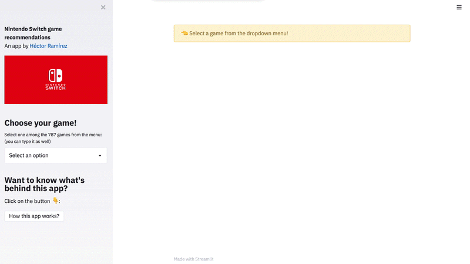

# Video game recommendation system

> **Note:** The app is currently not live but can be run by cloning the repository, installing the requirements in 
> `requirements.txt` and running 
> ```
> streamlit run NSRecommender_app.py
> ```

__End-to-end project involving web scraping, clustering analysis and web app development.__  

This is an end-to-end project where I built a web app that, given an input Nintendo Switch game, gives you a set of recommended video games using unsupervised learning techniques and natural language processing on the games' gameplay or plot.

__The app is accessible from the following link: ~~https://hectoramirez.github.io/Recommender-app.html~~__


[](https://opensource.org/licenses/MIT)





## Files

* `Switch_games.ipynb`: Web scraping Wikipedia articles using Beutiful Soup. The full dataset is generated using the code in this notebook.

    First, I scrap the tables in
    * https://en.wikipedia.org/wiki/List_of_Nintendo_Switch_games_(A–L)
    * https://en.wikipedia.org/wiki/List_of_Nintendo_Switch_games_(M–Z)#Games_list_(M–Z)

 where I select only the games with links to their wiki pages. Then, for each game, I access their pages and scrap the paragraphs contained in the Gameplay or Plot sections or both if exist.
 
 Finally, I clean the text and drop null entries.


* `Game_similarity.ipynb`: Here the texts are processed by tokenizing and stemming them, and are vectorized using NLTK's TF-IDF vectorizer.

    From the TF-IDF matrix, the similarity distances between the texts are computed by substracting the cosine of vectors from 1.
    
    Finally, recommendations are queried using the matrix: once a game is selected, the top 5 closest games are returned.


* `NSRecommender_app.py`: Streamlit web app. The app is hosted in an Amazon Web Services EC2 instance, accessible from [~~here~~]().

## Contact

For comments or questions, drop me a message at vanhramirez@gmail.com.